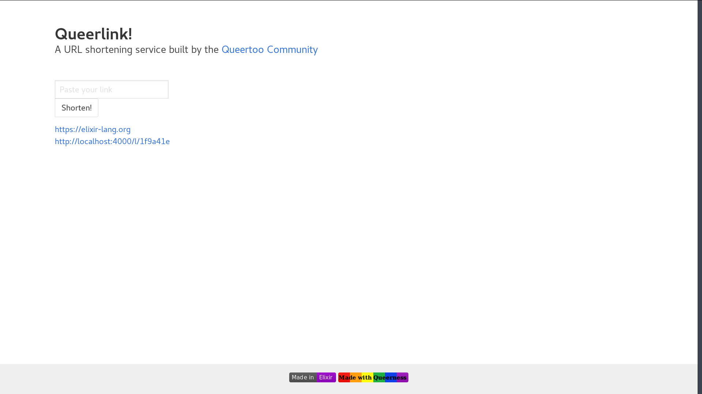

# Queerlink v2 [![Made in Elixir][elixir]](https://elixir-lang.org) [![Made with Queerness][queerness]]()

>A simple and efficient link shortener.




## Features

- [x] A super-easy-to-use JSON API;
- [x] Your data is stored in an sqlite3 database. Backup with `rsync` or `scp`;
- [x] A clean, no-fuss web interface;
- [ ] A documentation.


## Using the API

With HTTPie, simply type `http POST :4000/s url=https://elixir-lang.org` (for instance).
You can test what you get with `http http://localhost:4000/l/20gd6ne`.

the POST request will, in case of success, return this schema:

```JSON
{
    "longUrl": "https://elixir-lang.org",
    "shortUrl": "http://localhost:4000/l/20gd6ne",
    "status": "success"
}
```


## Installation

### Local Installation

Queerlink requires Elixir v1.4 and (it's in your best interest) OTP20.  
Don't forget to export the `PORT` and `MIX_ENV` environment variables, the latter being `prod` when you're reading for launching live!

Next:

1. Install dependencies with `mix deps.get`;
2. In an `prod` environment, don't forget to generate a secret key base with `mix phx.gen.secret` and add this snippet in `config/prod.secret.exs`:
```elixir
config :queerlink, QueerlinkWeb.Endpoint,
  secret_key_base: "mysecret"
```
3. Create and migrate your database with `mix ecto.create && mix ecto.migrate`;
4. Install Node.js dependencies with `npm install`;
5. Start the beast with `iex -S mix phx.server`

### Producing a release

```bash
$ export MIX_ENV=prod PORT=4000
$ cd assets/ && npm i
$ ./node_modules/brunch/bin/brunch b -p
$ cd ../ && mix phx.digest
$ mix release --env=prod
$ _build/prod/rel/queerlink/bin/queerlink migrate
$ _build/prod/rel/queerlink/bin/queerlink start|foreground|console
```


### In addition…

The `doc/nginx/` directory contains the necessary configuration to run Queerlink behind an Nginx reverse proxy.
You can find a [wrk][wrk] lua script in `doc/` as well.


## License

This software is licensed under the [MIT license](LICENSE).

[queerness]: https://cdn.rawgit.com/Queertoo/Queerlink/master/assets/static/images/rainbow-queerness.svg
[elixir]: https://cdn.rawgit.com/Queertoo/Queerlink/master/assets/static/images/elixir.svg
[wrk]: https://github.com/wg/wrk
